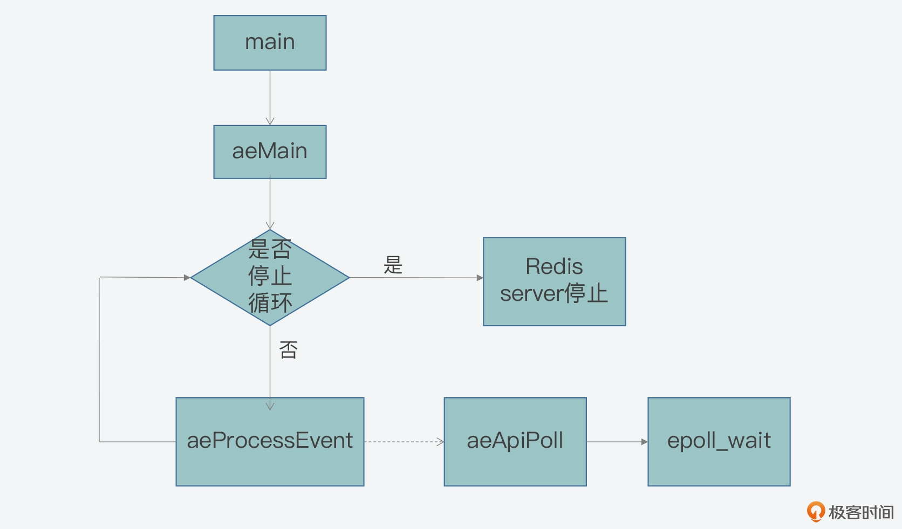

### Reactor模型

 - acceptor：负责处理连接事件，并创建响应handler，用于处理连接后的读写事件
 - handler：读写事件处理
 - reactor：专门负责事件的分发，当连接事件到来时，reactor将连接事件交给acceptor处理，当有读写请求时，reactor将事件交给handler处理

### Redis事件驱动框架

总体分为两部分

- 事件初始化
- 事件捕获、分发、处理主循环

以文件事件为例

```c
typedef struct aeFileEvent {
    int mask; /* one of AE_(READABLE|WRITABLE|BARRIER) */
    aeFileProc *rfileProc; //AE_READABLE类型事件处理函数
    aeFileProc *wfileProc; //AE_WRITABLE类型事件处理函数
    void *clientData;  //客户端私有数据指针
} aeFileEvent;
```

#### 事件处理框架main函数

```c
//ae.c
void aeMain(aeEventLoop *eventLoop) {
    eventLoop->stop = 0;
    while (!eventLoop->stop) {
        aeProcessEvents(eventLoop, AE_ALL_EVENTS|
                                   AE_CALL_BEFORE_SLEEP|
                                   AE_CALL_AFTER_SLEEP);
    }
}

int aeProcessEvents(aeEventLoop *eventLoop, int flags) {
    int processed = 0, numevents;
    
    /* 若没有事件处理，则立刻返回*/
    if (!(flags & AE_TIME_EVENTS) && !(flags & AE_FILE_EVENTS)) return 0;
    /*如果有IO事件发生，或者紧急的时间事件发生，则开始处理*/
    if (eventLoop->maxfd != -1 || ((flags & AE_TIME_EVENTS) && !(flags & AE_DONT_WAIT))) {
    //...
    }
    /* 检查是否有时间事件，若有，则调用processTimeEvents函数处理 */
    if (flags & AE_TIME_EVENTS)
    processed += processTimeEvents(eventLoop);
    /* 返回已经处理的文件或时间*/
    return processed;
}
```

这三个分支分别对应了以下三种情况：
- 情况一：既没有时间事件，也没有网络事件；
- 情况二：有 IO 事件或者有需要紧急处理的时间事件；
- 情况三：只有普通的时间事件

#### 事件捕获

我们来看一下情况二

当该情况发生时，Redis 需要捕获发生的网络事件，并进行相应的处理。那么从 Redis 源码中我们可以分析得到，在这种情况下，aeApiPoll 函数会被调用，用来捕获事件，
如下所示：

```c
//ae_epoll.c
static int aeApiPoll(aeEventLoop *eventLoop, struct timeval *tvp) {
    //...
    //调用epoll_wait获取监听到的事件
    retval = epoll_wait(state->epfd,state->events,eventLoop->setsize,
            tvp ? (tvp->tv_sec*1000 + tvp->tv_usec/1000) : -1);
    if (retval > 0) {
        int j;
        //获得监听到的事件数量
        numevents = retval;
        //针对每一个事件，进行处理
        for (j = 0; j < numevents; j++) {
             //保存事件信息
        }
    }
    return numevents;
}
```




#### 事件注册

server初始化时调用

```c
//server.c
void initServer(void) {
    //...
    for (j = 0; j < server.ipfd_count; j++) {
        if (aeCreateFileEvent(server.el, server.ipfd[j], AE_READABLE,
            acceptTcpHandler,NULL) == AE_ERR)
            {
                serverPanic("Unrecoverable error creating server.ipfd file event.");
            }
  }
  //...
}
```

```c
//ae.c
int aeCreateFileEvent(aeEventLoop *eventLoop, int fd, int mask,
        aeFileProc *proc, void *clientData)
{
    if (fd >= eventLoop->setsize) {
        errno = ERANGE;
        return AE_ERR;
    }
    aeFileEvent *fe = &eventLoop->events[fd];

    //调用aeApiAddEvent注册事件
    if (aeApiAddEvent(eventLoop, fd, mask) == -1)
        return AE_ERR;
    fe->mask |= mask;
    if (mask & AE_READABLE) fe->rfileProc = proc;
    if (mask & AE_WRITABLE) fe->wfileProc = proc;
    fe->clientData = clientData;
    if (fd > eventLoop->maxfd)
        eventLoop->maxfd = fd;
    return AE_OK;
}
```

以linux的为例

```c
//ae_epoll.c
static int aeApiAddEvent(aeEventLoop *eventLoop, int fd, int mask) {
    aeApiState *state = eventLoop->apidata;
    struct epoll_event ee = {0}; /* avoid valgrind warning */
    /* If the fd was already monitored for some event, we need a MOD
     * operation. Otherwise we need an ADD operation. */
    int op = eventLoop->events[fd].mask == AE_NONE ?
    EPOLL_CTL_ADD : EPOLL_CTL_MOD;
    
    ee.events = 0;
    mask |= eventLoop->events[fd].mask; /* Merge old events */
    if (mask & AE_READABLE) ee.events |= EPOLLIN;
    if (mask & AE_WRITABLE) ee.events |= EPOLLOUT;
    ee.data.fd = fd;
    //调用epoll_ctl进行事件注册
    if (epoll_ctl(state->epfd,op,fd,&ee) == -1) return -1;
    return 0;
}
```
