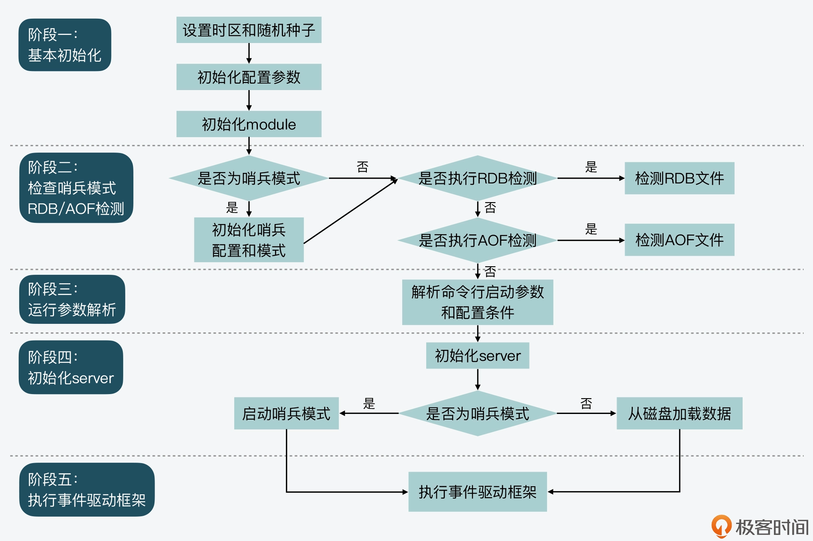

### 配置加载流程

1、调用initServerConfig为各种参数设置默认值

这些参数定义在server.h中，都是以CONFIG_DEFAULT为头的宏中

2、main函数逐一解析命令行参数

redis的命令行参数记得以--前缀

3、调用loadServerConfig进行第二、三轮赋值

4、调用loadServerConfigFromString对配置项字符串中的每一个配置进行匹配

### main函数启动流程

1、基本初始化

这个阶段主要是进行一些基本初始化工作，包括server运行时区，哈希函数的随机种子

2、检查哨兵模式，并检查是否要执行AOF或RDB检测

因为哨兵模式运行的初始化和系统参数不同

3、运行参数解析

4、初始化server

5、执行事件驱动框架

