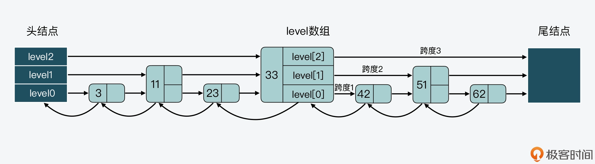

### zset常用命令

有序集合sortset

常用命令：

- zadd key score member（添加元素，score为排序依据，可以是浮点数）
- zcard key（有序集合元素个数）
- zcount key min max（统计key中score在[min, max]之间的元素个数）
- zrange key start end [withscores]（返回有序集合中下标从start到end的集合，score由低到高，如果加上withscores，那么score也会返回）
- zrangebyscore key min max [limit offset count] [withscores]（返回key中score在[min, max]之间元素，也可以加上limit offset count 和 withscores）
- zrank key member（返回member在key中的排名，以score由低到高排，最低为第0名）
- zrem key member (移除member)
- zremrangebyscore key min max（移除key中score在[min, max]之间的member）
- zrevrange key start end [withscores]（返回有序集合中下标从start到end的集合，score由高到低，如果加上withscores，那么score也会返回）
- zscore key member（返回member的score值）

### zset数据结构

```c
typedef struct zset {
    dict *dict; //哈希表
    zskiplist *zsl; //跳表
} zset;
```

哈希表之前已经写过，在zset中哈希表保存的是<元素，权重>

### zskiplist数据结构

```c
typedef struct zskiplistNode {
    sds ele; //sort set 中的元素
    double score; //元素权重
    struct zskiplistNode *backward; //后向指针
    struct zskiplistLevel {
        struct zskiplistNode *forward; //上一层的前向指针
        unsigned long span; //跨度
    } level[];
} zskiplistNode;

typedef struct zskiplistNode {
    sds ele; //sort set 中的元素
    double score; //元素权重
    struct zskiplistNode *backward; //后向指针
    struct zskiplistLevel {
        struct zskiplistNode *forward; //上一层的前向指针
        unsigned long span; //跨度
    } level[];
} zskiplistNode;

typedef struct zskiplist {
    struct zskiplistNode *header, *tail; //头节点、尾节点
    unsigned long length; //跳表长度
    int level; //跳表最大层数
} zskiplist;
```



